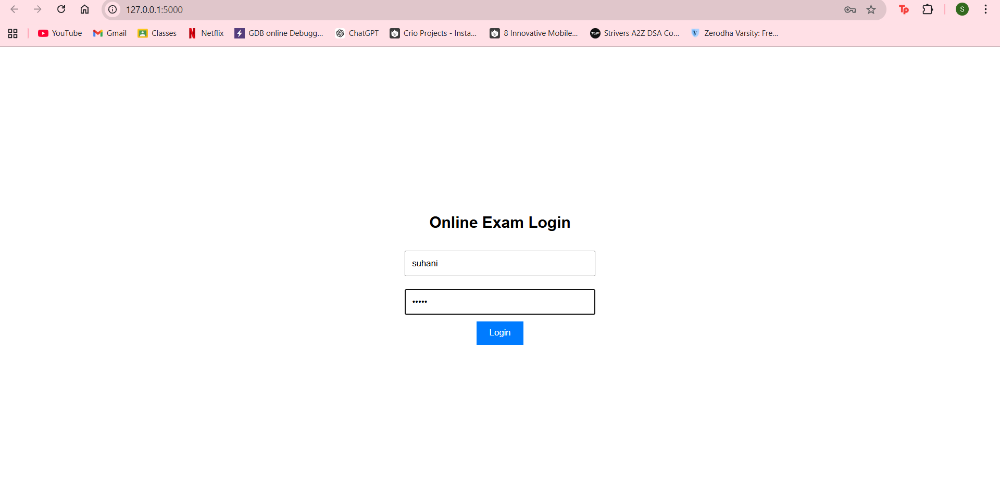
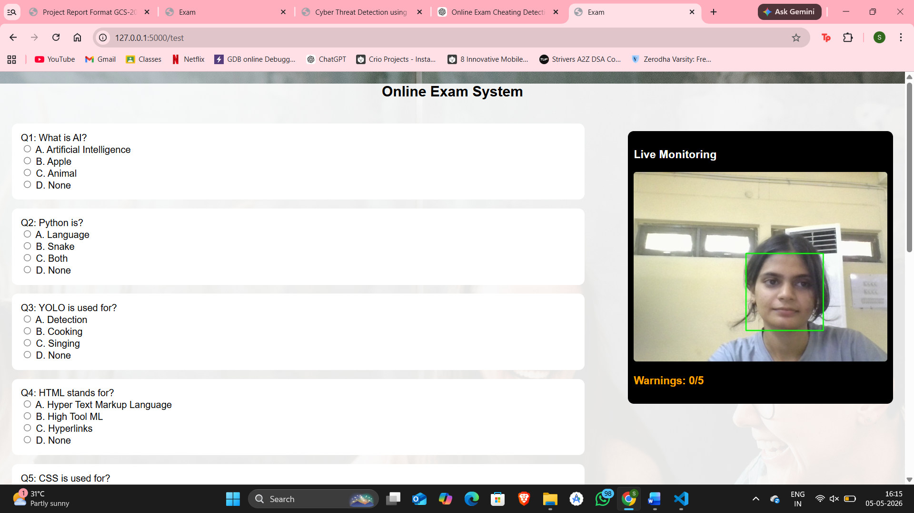
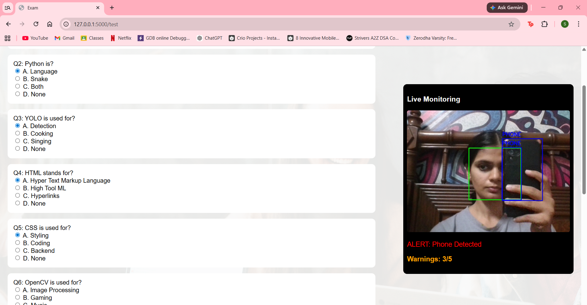
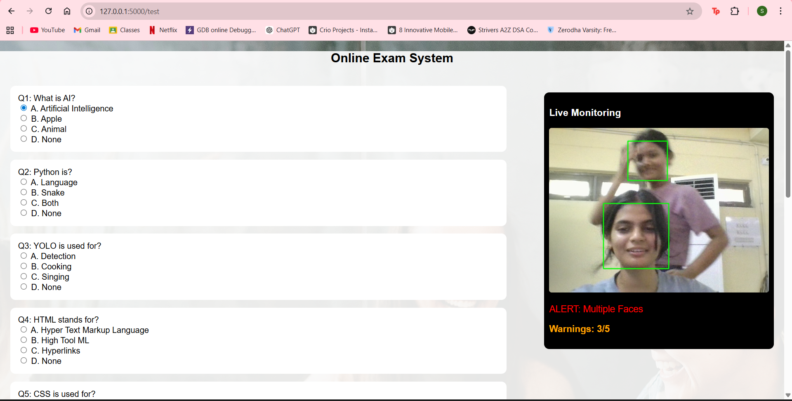
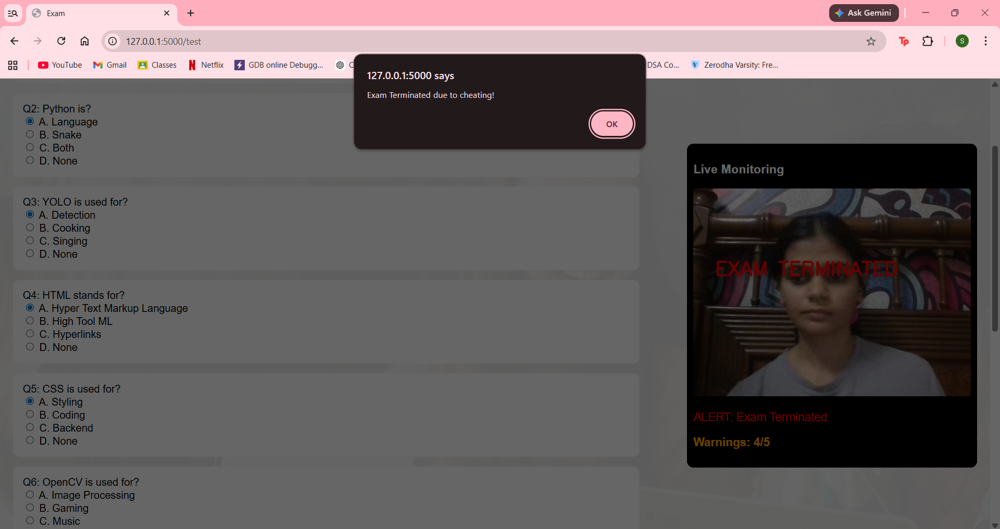

# 🎓 AI-Based Online Exam Cheating Detection System

An AI-powered online exam proctoring system that monitors students in real-time using Computer Vision and Deep Learning techniques. The system detects suspicious activities such as multiple faces, mobile phone usage, browser tab switching, and head movement to help maintain fairness and integrity during online examinations.

---

## 📌 Features

- 👤 **Multiple Face Detection**
  - Detects more than one person in the webcam frame using OpenCV Haar Cascade Classifier.

- 📱 **Mobile Phone Detection**
  - Uses YOLOv8 to identify mobile phones in real time.

- 👀 **Head Movement Detection**
  - Detects when the student looks significantly away from the screen.

- 🌐 **Tab Switching Detection**
  - Monitors browser visibility changes using JavaScript to detect tab switching or window minimization.

- ⚠️ **Warning Counter System**
  - Generates warnings for suspicious activities.
  - Implements a cooldown mechanism to avoid duplicate warnings.

- ❌ **Automatic Exam Termination**
  - Automatically terminates the exam after 5 warnings.

- 🎥 **Real-Time Monitoring**
  - Live webcam feed with visual alerts and warning display.

---

## 🛠️ Tech Stack

| Technology | Purpose |
|------------|---------|
| Python | Backend Programming |
| Flask | Web Framework |
| OpenCV | Face Detection & Image Processing |
| YOLOv8 | Mobile Phone Detection |
| HTML | Frontend Structure |
| CSS | User Interface Design |
| JavaScript | Dynamic UI & Tab Switching Detection |

---

## 📂 Project Structure

```
Online-Exam-Cheating-Detection-System/
│── app.py
│── haarcascade_frontalface_default.xml
│── yolov8n.pt
│── templates/
│   ├── login.html
│   ├── welcome.html
│   └── test.html
│── .gitignore
│── requirements.txt
│── README.md
```

---

## ⚙️ Working

1. Student logs into the examination portal.
2. Webcam monitoring starts after clicking **Start Exam**.
3. The system continuously monitors the student using OpenCV and YOLOv8.
4. The following activities are detected:
   - Multiple faces
   - Mobile phone usage
   - Looking away from the screen
   - Browser tab switching
5. Each suspicious activity increases the warning counter.
6. After **5 warnings**, the exam is automatically terminated.

---

## 🧠 Detection Modules

### 🔹 Face Detection
- Implemented using OpenCV Haar Cascade Classifier.
- Detects frontal faces in real time.
- Generates alerts for multiple face detection.

### 🔹 Mobile Phone Detection
- Implemented using YOLOv8.
- Detects mobile phones using object detection with confidence thresholding.
- Displays bounding boxes around detected phones.

### 🔹 Head Movement Detection
- Calculates the horizontal center of the detected face.
- Compares it with the frame center.
- Generates a "Looking Away" alert if the threshold is exceeded.

### 🔹 Tab Switching Detection
- Implemented using JavaScript `visibilitychange` event.
- Detects when the user leaves the examination tab.
- Sends the event to the Flask backend to update the warning counter.

---

## 📸 Screenshots

### 🔐 Login Page
Users enter their credentials to access the online examination portal.



---

### 👋 Welcome Page
After successful authentication, students are welcomed and can start the examination.


---

### 📝 Online Examination Interface
The examination page displays multiple-choice questions along with a live monitoring panel.



---

### 📱 Mobile Phone Detection
The system detects the presence of a mobile phone using YOLOv8 and immediately generates a warning.



---

### 👥 Multiple Face Detection
If more than one person appears in front of the webcam, the system identifies multiple faces and increments the warning counter.



---

### 👀 Looking Away Detection
The application monitors the user's head position and detects significant sideways movements that may indicate suspicious behavior.


---

### ❌ Exam Termination
Once the warning limit is reached, the examination is automatically terminated to maintain examination integrity.



## 💻 Installation

Clone the repository:

```bash
git clone https://github.com/YOUR_USERNAME/Online-Exam-Cheating-Detection-System.git
```

Move into the project directory:

```bash
cd Online-Exam-Cheating-Detection-System
```

Install dependencies:

```bash
pip install -r requirements.txt
```

Run the application:

```bash
python app.py
```

Open your browser:

```
http://127.0.0.1:5000
```

---

## 📈 Future Scope

- Eye Tracking
- Voice Activity Detection
- Facial Recognition Authentication
- Cloud Deployment
- AI-based Behaviour Analysis
- Multi-camera Monitoring

---

## 📚 Applications

- Online University Examinations
- Government Recruitment Exams
- Remote Certification Tests
- Online Interviews
- E-learning Platforms

---

## 👨‍💻 Authors

- **Suhani Setia**
- **Vandana Singh**
- **Sehajpreet Kaur**

Department of Computer Science & Engineering  
Sant Longowal Institute of Engineering & Technology (SLIET)

---

## 📄 License

This project is developed for academic and educational purposes.